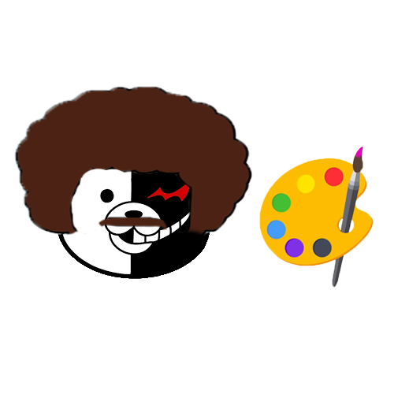
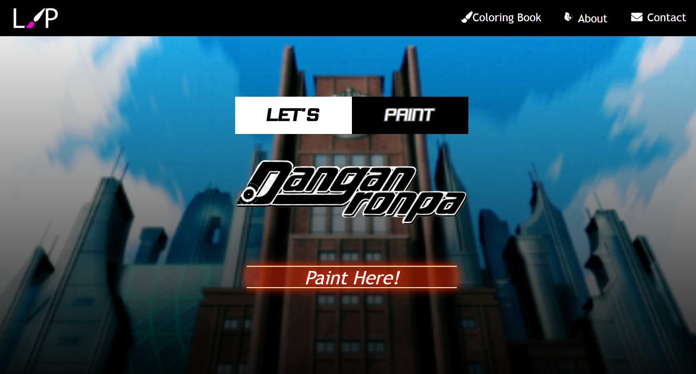
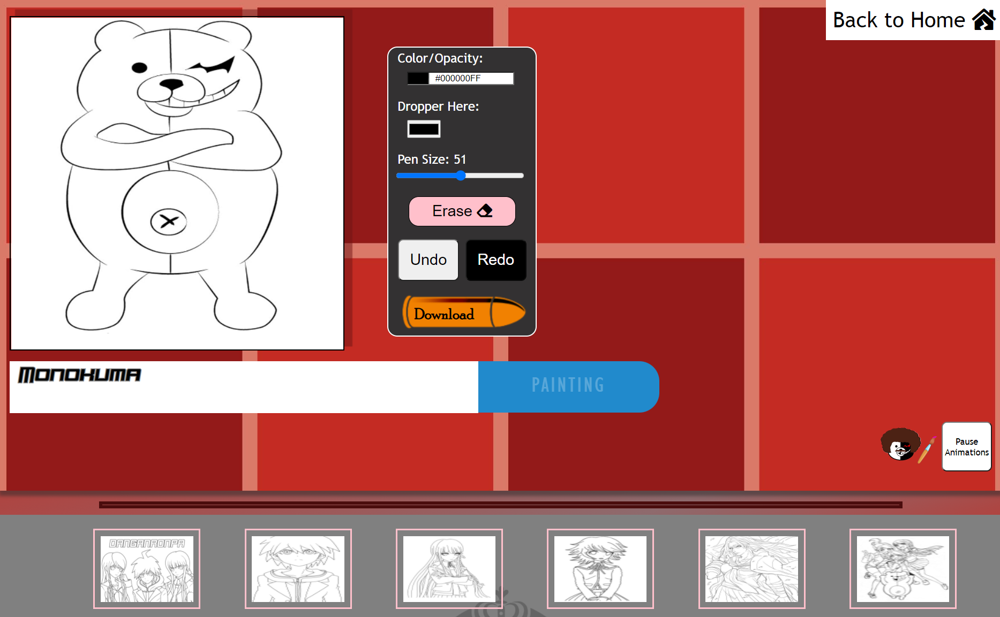

# Danganronpa Coloring Book

<!-- PROJECT LOGO -->
<br />
<p align="center">
  <a href="https://adesuwa-osagie.github.io/hackathon-coloring-book/">
    
  </a>

  <h3 align="center">Danganronpa Coloring Book</h3>

  <p align="center">
    A fan-made coloring booking app based on the Japenese visual novel franchise called <em>Danganronpa</em>
  </p>
</p>

<!-- TABLE OF CONTENTS -->
<details open="open">
  <summary><h2 style="display: inline-block">Table of Contents</h2></summary>
  <ol>
    <li>
      <a href="#about-the-project">About The Project</a>
      <ul>
        <li><a href="#built-with">Built With</a></li>
      </ul>
    </li>
    <li>
      <a href="#getting-started">Getting Started</a>
      <ul>
        <li><a href="#prerequisites">Prerequisites</a></li>
        <li><a href="#installation">Installation</a></li>
      </ul>
    </li>
    <li><a href="#contributor">Contributor</a></li>
    <li><a href="#resources">Resources</a></li>
  </ol>
</details>

---

<!-- ABOUT THE PROJECT -->
## About The Project

The project was made for Mintbean's November 2021 Hiring Hackathon, using HTML, CSS, JavaScript, and jQuery.

### User Story

As a user, I want to drag a mouse across a canvas to make free-form lines so that I can paint a picture. 

### Landing Page

<a href="https://adesuwa-osagie.github.io/hackathon-coloring-book/" target="_blank"></a>
<br/>

### The App
<a href="https://adesuwa-osagie.github.io/hackathon-coloring-book/color-book.html" target="_blank"></a>
<br/>

### Built With
<br/>

* 
* 
* 
<br/>

---

<!-- GETTING STARTED -->
## Getting Started

To get a local copy up and running, follow these simple steps:

### Prerequisites

#### Online
* Visit the <a href="https://adesuwa-osagie.github.io/hackathon-coloring-book/" target="_blank">landing page</a>.

#### Offline
1. Clone the repo from the main branch
   ```
   git clone https://github.com/adesuwa-osagie/hackathon-coloring-book.git
   ```
2. Open the file "index.html" with "Live Server."

### Installation

* No installation required. 
* You may go <a href="https://adesuwa-osagie.github.io/hackathon-coloring-book/" target="_blank">here</a> to view the landing page.

---

## Contributor

### Adesuwa Osagie
<br/>

[](https://www.linkedin.com/in/adesuwa-osagie/) [](https://github.com/adesuwa-osagie)

---
## Resources

* [Learn HTML5 Canvas By Creating A Drawing App | HTML Canvas Tutorial](https://www.youtube.com/watch?v=3GqUM4mEYKA&t=1s)

    * How this project differentiate from the above tutorial can view in this <a href="https://github.com/adesuwa-osagie/drawing-app-practice" target="_blank">project<a>. There, I practiced how to make the canvas and corrected errors that were found during practice. 

* [CANVAS JavaScript Drawing App 🎨 | Draw ● Undo ● Erase ● Colors | Full HTML5 Canvas App Tutorial](https://www.youtube.com/watch?v=wCwKkT1P7vY)

  * How this project differentiate from the above tutorial can view in this <a href="https://github.com/adesuwa-osagie/drawing-app-2" target="_blank">project<a>. There, I practiced how to make the canvas, corrected errors that were found during practice, and tested out ideas that were later added to this project.

* [From Figma to code](https://scrimba.com/learn/figmatocode)
  
  * This was my go-to source for re-learning about "position: flex" and "position: absolute" within a couple of hours. Thanks to source, I was able to create my own technique: a double background with decreased opacity 😎.

* [The YouTube Community](www.youtube.com)
  
  * From relearning about Danganronpa to learning techniques for creating images for backgrouds.

* [Stack Overflow](https://stackoverflow.com/)
  * Using non-technical terms, I was able to find solutions to techniques that I wanted to implement in this project.


